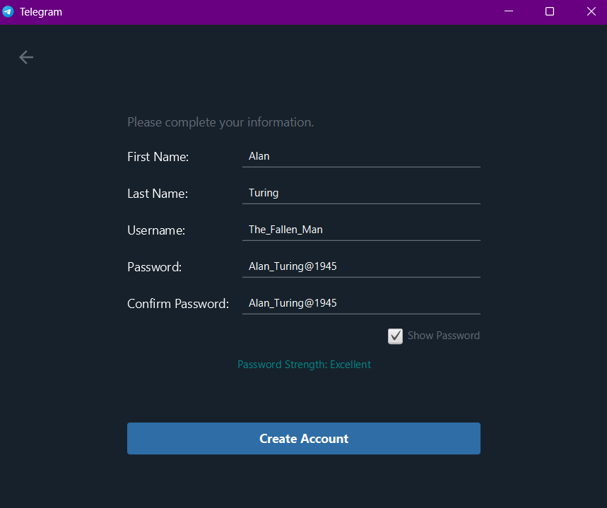
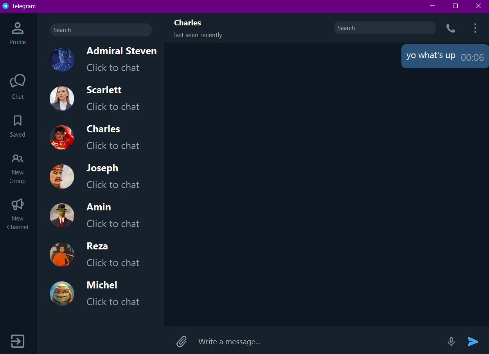
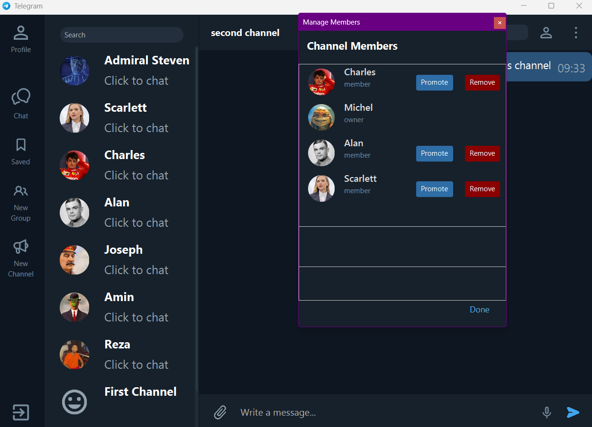

# Telegram


---

## 📂 Table of contents

- [Description](#description)
- [Thechnology Stack](#thechnology-stack)
- [Project Structure](#project-structure)
- [Features](#features)
- [Setup](#setup)
- [Demo](#demo)
- [Credits](#credits)
- [License](#license)

---

## 💬 Description

This project is a the final project of the Advanced Programing course at SBU. The goal of this project is to make a clone of Telegram that look like it as close as possible. We made this desktop program with **Java** programing language, **JavaFX** library for frontend, **socket** for Network and **MySQL** for the program's database. We hope this repository and this project be useful for you and enjoy using out program and our codes.❤️

---

## 🧰 Thechnology Stack

| Layer          | Thechnology                                                                                                                                              |
|----------------|----------------------------------------------------------------------------------------------------------------------------------------------------------|
|**Client (UI)** |                                                                       |
|**Server**      |                                                                           |
|**Database**    |                                                        |
|**Networking**  | |
|**API**         |                                                                           |

---

## 🗂️ Project Structure

```
/java
┃ ┃
┃ ┣ /Controllers    # JavaFX controller files
┃ ┃
┃ ┣ /Database       # database schema
┃ ┃
┃ ┣ /Models
┃ ┃
┃ ┣ /ToolBox        # API and useful tools
┃ ┃
┃ ┣ /Views          # .fxml files
┃ ┃
┃ ┣ /Server
┃ ┃
┃ ┣ /resources
┃    ┣ /css         # css style
┃    ┃
┃    ┣ /img         # project's images
┃    ┃
┃    ┗ /stickers    # in program chat's stickers
┃
┗ /Readme.md
```

---

## 🚀 Features

Here are the core features included in the **Telegram app** 📨:

- 🔒 **Hashing Passwords** your paasword is hashed with jcrypt
- 💬 **Private Chats** one-to-one messaging
- 👥 **Group Chats** chat with a group of people  
- 📢 **Channels** for broadcasting messages to large audiences  
- 🖼️ **Media Sharing** photos, videos, files, documents, music, voice messages
- 🎙️ **Voice Messages**  send voice messages
- 😀 **Stickers & GIFs**  use sticker and send gifs
- 🌙 **Dark / Light Mode** themes  
- 🔍 **Powerful Search** across chats and messages  
- 📂 **Saved Message** save your important messages
- 🖥️ **Desktop Support**  
- 🔔 **Mute Options**  mute any chat, group or channel you want
- 🛠️ **Account Management** (usernames, profile pictures, bio)  
- ⚡ **Fast & Responsive UI/UX**  
- 📡 **Socket Networking** for communication  
- 🏗️ **OOP-Based Architecture**

---

## 🛠️ Setup

Follow these steps to set up and run the project locally ⚡:

1. **Install JDK (Java Development Kit)**  
   - Download and install the latest JDK from [Oracle](https://www.oracle.com/java/technologies/javase-downloads.html) ☕  
   - Make sure to set the environment variable `JAVA_HOME`.  

2. **Install JavaFX SDK**  
   - Download JavaFX SDK from [GluonHQ](https://gluonhq.com/products/javafx/) 📦  
   - Extract it and place it somewhere safe (you’ll link it later in IntelliJ).  

3. **Install Maven**  
   - Download and install Maven from [Maven Official Site](https://maven.apache.org/download.cgi) 📑  
   - Add Maven to your system’s PATH.  

4. **Install IntelliJ IDEA**  
   - Download IntelliJ IDEA from [JetBrains](https://www.jetbrains.com/idea/download/) 💻  
   - Open the project folder in IntelliJ.  

5. **Configure JDK and JavaFX in IntelliJ**  
   - Go to `File > Project Structure > SDKs` and add your JDK.  
   - Add JavaFX libraries from the **JavaFX SDK `lib` folder** to the project.  

6. **Set Run Configuration**  
   - Navigate to `Run > Edit Configurations`.  
   - Add a new **Application** configuration.  
   - Set the **Main Class** to `Main` from the **Controllers** package.  
   - Add VM Options:
    ```
     --module-path "path_to_your_javafx_lib" --add-modules javafx.controls,javafx.fxml
    ```  
   - ✅ Enable **Allow multiple instances**.  

7. **Start the Server**  
   - Run `Server.java` from the **Server** package 🖧  

8. **Run the Client App**  
   - Run `Main.java` from the **Controllers** package ▶️  

🎉 Boom! The app should now be running — enjoy your Telegram clone!

---

## 📹 Demo

### LOGIN TO THE APP



---

### CHAT WITH SOME FAMOUS PEOPLE



---

### PROMOTE & REMOVE PEOPLE FROM YOUR CHANNEL



---

## 🤝 Credits

[Sadra seyyed Tabaei](https://github.com/sadra3st), [Meraj Derafshi](https://github.com/MerajDerafshi) & [Amin Asadi](https://github.com/yoaminoo) (contributers)

---

## 📄 License

MIT License
Copyright (c) 2025 Sadra Seyedtabaei
